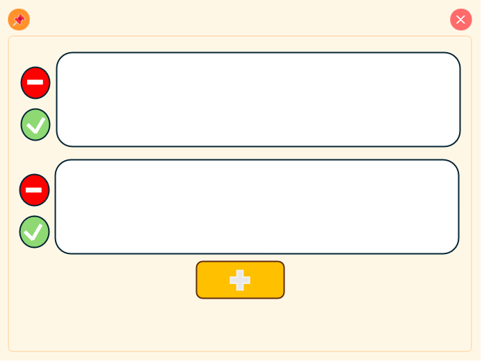

# 桌面便签 (Desktop Sticky Notes)

一个简洁美观的桌面便签应用，支持多条便签管理、状态切换和字体大小调整。


## 功能特点 (Features)

- 多便签管理
  - 支持添加多个独立便签单元格
  - 每个便签可独立编辑和管理
  - 便签状态切换（完成/未完成）
  - 支持删除单个便签

- 字体和显示控制
  - 每个便签独立的字体大小控制
  - 支持便签内容的滚动显示
  - 美观的界面设计

- 系统集成
  - 全局快捷键显示/隐藏便签
  - 系统托盘后台运行
  - 窗口置顶功能
  - 自动保存和加载便签内容

## 快捷键 (Shortcuts)

- `Shift + Alt + Q`: 显示/隐藏便签 (Show/Hide Notes)
- `Shift + Alt + W`: 切换窗口置顶 (Toggle Always on Top)
- `Ctrl + 鼠标滚轮`: 调节当前便签字体大小 (Adjust Current Note Font Size)
- `Shift + 鼠标滚轮`: 上下滚动浏览所有便签 (Scroll Through All Notes)

## 便签操作 (Note Operations)

- 添加新便签：点击底部的 "+" 按钮
- 完成便签：点击便签左侧绿色"✓"按钮
- 删除便签：点击便签左侧红色"×"按钮
- 调整字体：将鼠标放在便签上，按住 Ctrl 并滚动鼠标滚轮
- 浏览便签：按住 Shift 并滚动鼠标滚轮

## 安装依赖 (Install Dependencies)

```bash
pip install -r requirements.txt
```

## 运行方式 (How to Run)

1. 安装依赖：
```bash
pip install -r requirements.txt
```

2. 运行程序：
```bash
python sticky_note.py
```

## 技术特性 (Technical Features)

- 使用 PyQt5 构建现代化 GUI
- 事件过滤器处理复杂的鼠标事件
- 自动保存功能确保数据不丢失
- 优雅的窗口管理和状态切换

## 注意事项 (Notes)

- 便签内容会自动保存
- 可以通过系统托盘图标完全退出程序
- 窗口可以自由拖动和调整大小
- 支持多个便签的独立管理

## 更新日志 (Changelog)

### v2.0.0
- 新增多便签管理功能
- 添加便签状态切换功能
- 支持每个便签独立的字体大小控制
- 改进滚动和导航体验
- 优化界面设计和交互体验

### v1.0.0
- 初始版本发布
- 基本的便签功能
- 系统托盘集成
- 全局快捷键支持
